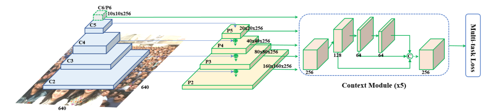

# RetinaFace

1. 重点
    
    1.  MultiTask Learning
        + 与其他Single Stage的检测模型不同, RetinaFace采用MultiTask的方式进行训练, 其中包括Box的分类损失(是否包含人脸)、Bounding Box的回归损失、5个人脸关键点的回归损失、一个3D->2D的重构损失, RetinaFace的损失函数如下所示;
        
     
    2. 结构
        + 采用Deformable Convolution代替一般卷积;
        + 在Feature Pyramid上, 使用Contect Module来进行特征提取;
        
        + 负责3D->2D的重构是一个图卷积网络来完成Mesh Decode, 后接一个Differentiable Renderer, 重构损失为重构前后2D图pixel-to-pixel的L1范数, 这是一个自监督的学习分支;
    3. 训练
        + 作者对WIDER FACE数据集进行了人脸关键5点的标注, 增加了监督信息的输入, 模型效果得到关键性的提升;
        + Anchor Match中:
            + 和Ground True的IOU大于0.5的Anchor, 为正样本;
            + Ground True的IOU小于0.5且大于0.3的Anchor, 为负样本;
            + Ground True的IOU小于0.3的Anchor, 在训练过程中忽略, 减少大量无价值的负样本;
        + 和RetinaNet不同, 训练采用OHEM来解决样本unbalance的问题, 而非Focal Loss;
        + 分类损失使用的是Softmax Loss;

2. Ref:
    + 原论文 https://arxiv.org/abs/1708.02002
    + Deformable Convolution相关 https://arxiv.org/abs/1703.06211
    + Mesh Decode相关 https://arxiv.org/abs/1904.03525