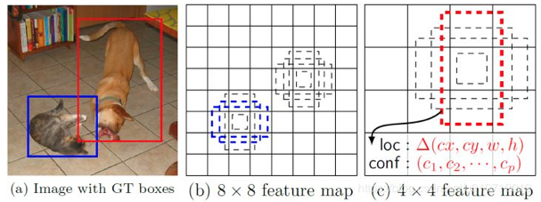

# SSD
1. 总流程
    1. 在每个不同尺寸的、有prediction的特征图上, 生成相应的DefaultBox(不同的大小和纵横比);
    2. 利用GroundTurth完成框匹配, 具体MatchStrategy如下:
        1. 先把与GT最重叠的DB配对上;
        2. 再把IOU大于阈值(0.5)的DB与相应重叠的GT配对上;
        步骤1的目的是能够保证每一个GT都有一个DB对应上, 步骤2的目的是减少负样本的数量、增大正样本的数量和检索模糊的匹配结果
        3. 完成配对后, 每一个DB与GT都能做以下计算
        ```sh
        假设每一个DB为(dx, dy, dw, dh), 表示为框的xy坐标和宽高
        同理GT表示为(gx, gy, gw, gh)
        则每个被匹配DB回归的目标为可以转成LOC=((gx-dx)/dw, (gy-dy)/dh, log(gw/dw), log(gh/dh))
        加上对框的类别分类C=(背景, 类别1, ..., 类别N)
        每个被配对的框对应学习目标为[LOC, C]
        ```  
        
    3. 模型在每个有prediction输出的特征图的每一个位置上输出prediction, 学习每个框输出的[LOC, C]
    
2. Ref: 
    + https://arxiv.org/abs/1512.02325
    + https://blog.csdn.net/u010712012/article/details/86555814